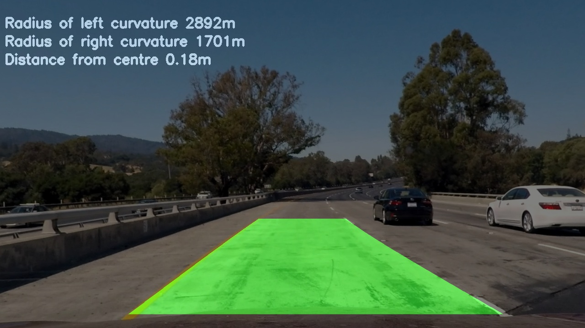

# Advanced Lane Finding

## 1.Introduction

This repo contains code to detect road lanes on either a set of separate images or a single video file.

The goals of this repo are the following:

* Compute the camera-calibration matrix and distortion coefficients given a set of chessboard images.
* Apply a distortion correction to raw images.
* Use color transforms, gradients, etc., to create a thresholded binary image.
* Apply a perspective transform to rectify binary image ("birds-eye view").
* Detect lane pixels and fit to find the lane boundary.
* Determine the curvature of the lane and vehicle position with respect to center.
* Warp the detected lane boundaries back onto the original image.
* Output visual display of the lane boundaries and numerical estimation of lane curvature and vehicle position.

## 2. Environment

#### Install the environment

To create a conda environment with the project's dependencies please run the following:

    conda create -n lane-finding python=3.6
    conda activate lane-finding
    pip install requirements.txt

#### Requirements

The repo has been tested to work with the following dependencies:

1. python==3.6.13
1. click==8.0.1
1. matplotlib==3.3.4
1. moviepy==1.0.3
1. numpy==1.19.5
1. opencv-python==4.5.2.52

## 3. Entrypoint

To start the lane detection pipeline first set up the python path

    PYTHONPATH=/path/to/the/repo
    
For detection on separate images run:
    
    python src/cli.py detect-images 
    --images_directory /path/to/images/directory/ 
    --calibration_directory /path/to/calibration/images/directory/ 
    --output_directory /directory/to/save/the/output/images 
    --record_all_layers {True} or {False}

Example:

    python src/cli.py detect-images --images_directory test_images --calibration_directory camera_cal --output_directory output_images --record_all_layers False

For detection on a video run:

    python src/cli.py detect-video
    --video_path /path/to/video/file
    --calibration_directory /path/to/calibration/images/directory/ 
    --output_directory /directory/to/save/the/output/images 
    --record_all_layers {True} or {False}

Example:

    python src/cli.py detect-video --video_path project_video.mp4 --calibration_directory camera_cal --output_directory output_video --record_all_layers False

The option record_all_layers will output frames with 3X2 subplots containing:

1. The image gradients
1. The image gradients on the region of interest (ROI)
1. The image gradients with a perspective transform applied
1. The detected lanes polygon
1. The detected polygon on the inverse perspective transform
1. The final frame with the road lanes, the curvature, and the distance from centre

## 4. Code structure

    src/
        --domain/
            ---- Contains all the classes which group a common type of operations inside them
        --infrastructure/
            ---- Contains all the project's parameters as constants
        --use_case/
            ---- Contains two use cases and the abstract class they inherit from
        cli.py (The command line interface script)

The repository contains 2 use cases:

1. ImageLanesDetector (responsible for detection on images)
1. VideoLanesDetector (responsible for detection on a video file)

Both are subclasses of the LanesDetector abstract class inside which the pipeline 
structure is defined. Each use case is first built and then ran. During the build phase
we use the FrameTransformer class to calibrate the camera and then to obtain the perspective transform
matrix (and its inverse).

The pipeline as defined in the _apply_pipeline() method of the LanesDetector class, contains the following steps:

1. Undistort the frame
1. Binarize the frame
1. Isolate the region of interest
1. Apply the perspective transform
1. Detect the road lanes
1. Apply the inverse perspective transform
1. Join lanes and text with the undistorted frame

## 5. Pipeline steps explanation

For a more detailed explanation of the pipeline steps please refer to the following documents:

1. [CAMERA_CALIBRATION.md](documentation/CAMERA_CALIBRATION.md)
1. [PERSPECTIVE_TRANSFORM.md](documentation/PERSPECTIVE_TRANSFORM.md)
1. [IMAGE_BINARIZATION.md](documentation/IMAGE_BINARIZATION.md)
1. [REGION_OF_INTEREST.md](documentation/REGION_OF_INTEREST.md)
1. [LANES_DETECTION.md](documentation/LANES_DETECTION.md)
1. [FINALIZE_FRAME.md](documentation/FINALIZE_FRAME.md)

## 6. Results

For the results please look 

[sa](project_video.mp4)