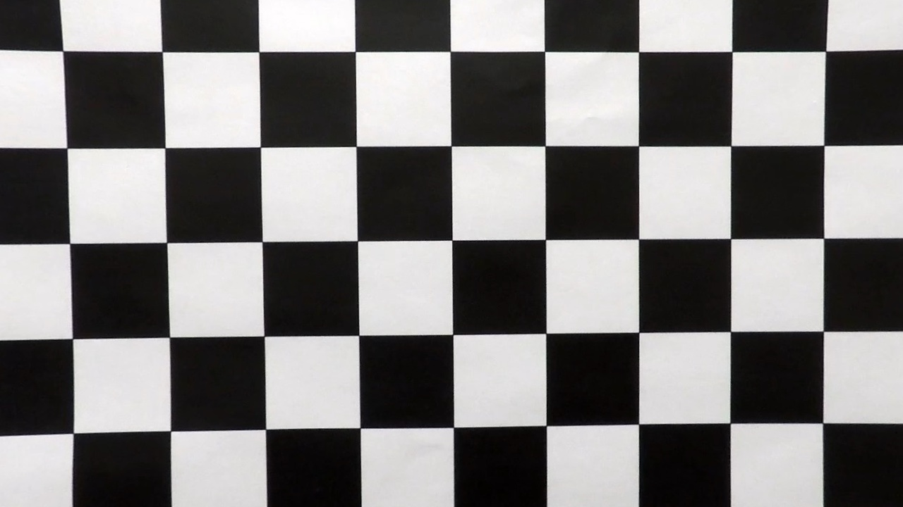

# Camera calibration

## 1. Description

Camera calibration is the process in which we use a set of (usually) chessboard images, taken from various angles and
distances, to calculate all the parameters that will allow us to transform distorted images into undistorted. Image
distortion mainly comes from the camera lenses and it is important to correct for it if we want to measure anything in
an image.

## 2. Calibration images

We use a set of 20 images for calibration contained in the camera_cal directory. Each image is a photo of the same
printed chessboard (9X6) taken using the same camera from various angles and distances.

#### Distorted image

#### Undistorted image

## 3. Code

The [FrameTransformer](../src/domain/frame_transformer.py) class is responsible to perform the camera calibration and
undistort an image is the though its calibrate_camera() and undistort_frame() methods.

#### The calibrate_camera method

The calibrate_camera is a two-step method, which first detects the chessboard corners in each of the calibration images.
Then it uses the openCV calibrateCamera function to obtain the camera_matrix, and the distortion_coefficients (if the
corner detection has succeeded).

The _detect_chessboard_corners method's objective is to create two lists; the `self.object_points_3d` which contains a (
9 * 6)X3 3D grid and the `self.frame_points_2d` which contains the (9 * 6) detected corners. Therefore, for each (9*6)
detected X&Y coordinates we match a 3D grid of corner indices.

    def calibrate_camera(self, calibration_frames: List[np.ndarray]) -> None:
        self._detect_chessboard_corners(calibration_frames)
        self._apply_camera_calibration(calibration_frames)

    def _detect_chessboard_corners(self, calibration_frames: List[np.ndarray]) -> None:
        all_object_points = np.zeros(shape=(NY * NX, 3), dtype=np.float32)
        all_object_points[:, :2] = np.mgrid[0:NX, 0:NY].T.reshape(-1, 2)
        for frame in calibration_frames:
            gray = self._to_gray(frame)
            ret, corners = cv2.findChessboardCorners(gray, (NX, NY), None)
            if ret:
                self.object_points_3d.append(all_object_points)
                self.frame_points_2d.append(corners)

    def _apply_camera_calibration(self, calibration_frames: List[np.ndarray]) -> None:
        if self.frame_points_2d:
            frame_shape = calibration_frames[0].shape[:2]
            _, self.camera_matrix, self.distortion_coefficients, _, _ = cv2.calibrateCamera(self.object_points_3d,
                                                                                            self.frame_points_2d,
                                                                                            frame_shape,
                                                                                            None,
                                                                                            None)
            get_logger().info("Calibration parameters calculated")
        else:
            get_logger().error("Couldn't detect correctly the chessboard corners. "
                               "Impossible to calculate calibration parameters.")
            raise RuntimeError

#### The undistort_frame method

This method is a wrapper around the openCV undistort function. As input is takes the distorted frame and outputs the
undistorted one.

    def undistort_frame(self, frame: np.ndarray) -> np.ndarray:
        return cv2.undistort(frame,
                             self.camera_matrix,
                             self.distortion_coefficients,
                             None,
                             self.camera_matrix)