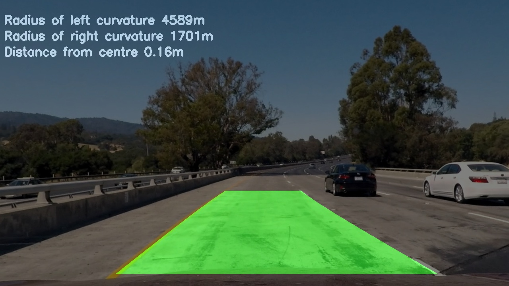
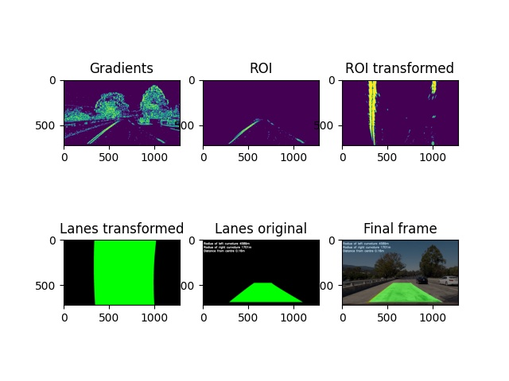

# Finalize frame

## 1. Description

In this step I am adding the detected lanes to the undistorted image and then saving it. 
If the record_all_layers option is True, then instead of saving only the final image I am saving an image with all the 
pipeline layers. 

## 2. Example images

#### Final image

### Final image with all layers

## 3. Code

The [LanesDetector](../src/use_case/lanes_detector.py) and [FrameLayersRecorder](../src/domain/frame_layers_recorder.py) 
classes are responsible for creating the final image. The LanesDetector class uses the _finalize_frame()
method to create the final image. The FrameLayersRecorder uses the record_all_layers() method to save all pipeline layers in the
output image.

#### The _finalize_frame method

    def _finalize_frame(self) -> None:
        self.frame[FINAL] = self._add_lanes_to_undistorted_frame()
        if self.record_all_layers:
            self.frame[FINAL] = self.frame_layers_recorder.record_all_layers(self.frame)

    def _add_lanes_to_undistorted_frame(self) -> np.ndarray:
        return (self.frame[UNDISTORTED] + self.frame[LANES_REVERTED].astype(int)) // 2

#### The record_all_layers method 

    @staticmethod
    def record_all_layers(frames: Dict[str, np.ndarray]) -> np.ndarray:
        figure, axes = plt.subplots(2, 3)
        axes[0, 0].imshow(frames[BINARIZED])
        axes[0, 0].set_title("Gradients")
        axes[0, 1].imshow(frames[ROI])
        axes[0, 1].set_title("ROI")
        axes[0, 2].imshow(frames[TRANSFORMED])
        axes[0, 2].set_title("ROI transformed")
        axes[1, 0].imshow(frames[LANES])
        axes[1, 0].set_title("Lanes transformed")
        axes[1, 1].imshow(frames[LANES_REVERTED])
        axes[1, 1].set_title("Lanes original")
        axes[1, 2].imshow(frames[FINAL])
        axes[1, 2].set_title("Final frame")
        figure.canvas.draw()
        data = np.fromstring(figure.canvas.tostring_rgb(), dtype=np.uint8)
        data = data.reshape(figure.canvas.get_width_height()[::-1] + (3,))
        return data

