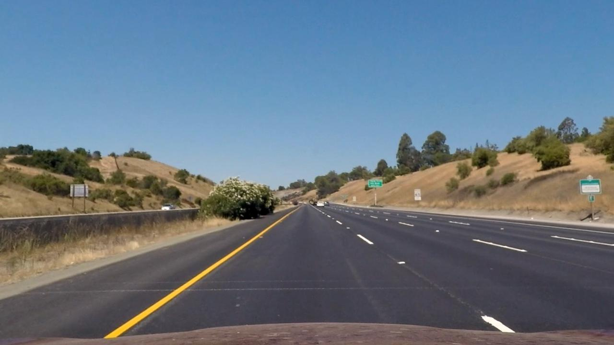
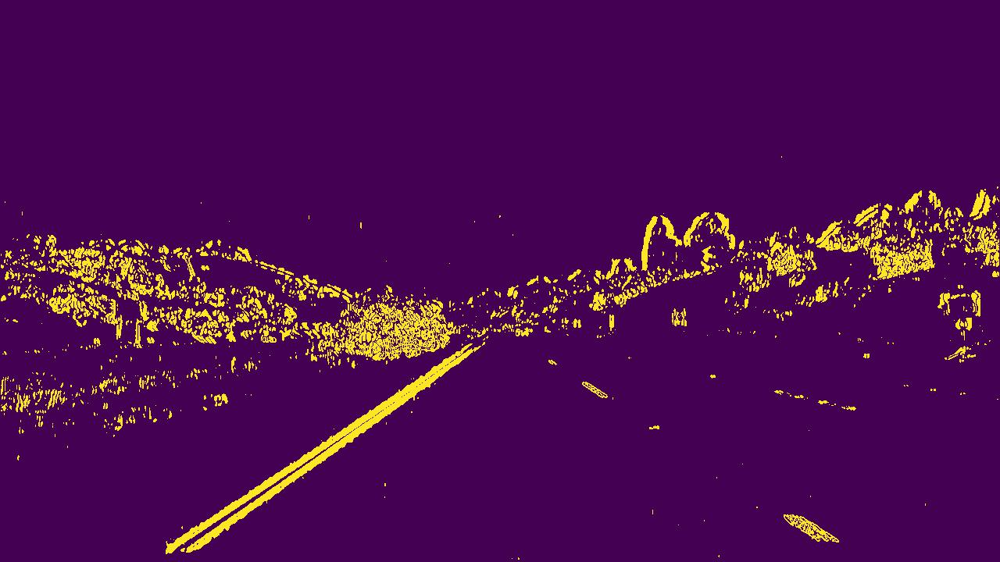

# Image binarization

## 1. Description

The process of image Binarization helps in focusing only of the specific pixels which are more likely to contain the
information we need. Here, it is performed in two steps; the calculation of the image gradients, and the isolation of
the desired gradient values. Detecting the image gradients is a process that helps in capturing the pixels in which
there are sudden changes in the image pixels, thus capturing the shape of objects or markings on the road; such as cars
and road lanes.

## 2. Example images

#### Before binarization

#### Binarized image

## 3. Code

The [FrameBinarizer](../src/domain/frame_binarizer.py) class is responsible to detect the gradients and binarize the
image through its binarize() method.

#### The binarize method

The binarize method is applying an HLS transform to the image and then selects the s channel which captures better the
road lanes in our case. Then it applies a convolution with a Sobel kernel to the image in order to get the image
gradients. Then it scales the image gradients to be between 0 and 255. Finally, it binarizes the image by isolating two
different ranges of gradients; the first for values from 10 to 100, and the second for values from 200 to 250. The value
ranges were empirically selected.

    def binarize(self, frame: np.ndarray) -> np.ndarray:
        s_channel = self._to_hls(frame)[:, :, 2]
        scaled_gradient_x = self._get_scaled_gradient_x(s_channel)
        sobel_binary = self._apply_threshold(scaled_gradient_x)
        get_logger().info("Computed frame gradients and binarized frame")
        return sobel_binary

    @staticmethod
    def _get_scaled_gradient_x(channel: np.ndarray) -> np.ndarray:
        sobelx = cv2.Sobel(channel, cv2.CV_64F, 1, 0, ksize=SOBEL_KERNEL_SIZE)
        scaled_sobel = np.uint8(255 * np.absolute(sobelx) / np.max(np.absolute(sobelx)))
        return scaled_sobel

    @staticmethod
    def _apply_threshold(frame: np.ndarray) -> np.ndarray:
        frame_binarized = np.zeros_like(frame)
        frame_binarized[(frame >= MAX_THRESHOLD[0]) & (frame <= MAX_THRESHOLD[1]) |
                        (frame >= MIN_THRESHOLD[0]) & (frame <= MIN_THRESHOLD[1])] = 1
        return frame_binarized

    @staticmethod
    def _to_hls(image: np.ndarray) -> np.ndarray:
        return cv2.cvtColor(image, cv2.COLOR_RGB2HLS)
