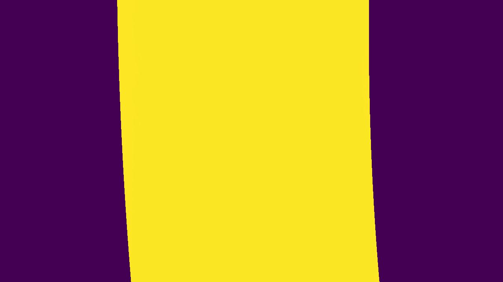

# Lanes detection

## 1. Description

This step is responsible for:

1. Detecting the road lanes in the binarized image after perspective transform
1. Calculating the curvature of the road
1. Calculating the distance from centre

## 2. Example images

#### Before lanes detection

#### After lanes detection

## 3. Code

The [LaneFinder](../src/domain/lane_finder.py) class is responsible to detect the road lanes, and the distance from
centre using its detect_lanes() method. The [LaneFitter](../src/domain/line_fitter.py)
is responsible to perform the polynomial fit on the detected lane using its fit_second_order_polynomial() method.
Finally, the [LanesDetector](../src/use_case/lanes_detector.py) puts everything together with its _find_road_lanes()
method and draws the final polygon.

#### The LanesDetector class

The LanesDetector class uses the LanesFinder, the LineFitter, and the FrameVisualizer to detect and draw the road lanes.

    def _find_road_lanes(self, frame: np.ndarray) -> np.ndarray:
        self.lane_finder.detect_lanes(frame, self.line_fitter.fit_parameters)
        self.line_fitter.fit_second_order_polynomial(frame, self.lane_finder.lanes)
        output_frame = self.frame_visualizer.draw_lanes(frame, self.line_fitter.polynomial)
        return output_frame

#### The LaneFinder class

The LaneFinder class detects X&Y lane points using the following method:

1. Calculate the histogram of nonzero points along the Y-axis. Then, initialize a sliding window search at both left and
   right part of the image. The two initial windows are initialized at the point of maximum-histogram frequency on the
   left and right part of the image. Then, the X&Y points defining each lane are defined to be all the nonzero indices
   inside each window.
2. Uses the lane curves found at the previous step to initialize and slide the window across them. If this fails to find
   all lane points at the correct side of the road, then it performs a histogram search as defined in step 1.

It is very important to note that we collect lane points for the last couple of frames using the
`MEMORY_TIME_SPAN` parameter. In the case the step 1 search needs to be repeated due to non detection of lanes 
we keep the last N lanes as defined in the `KEEP_LAST_FRAMES` parameter. Both parameters are set in 
[parameters.py](../src/infrastructure/parameters.py). Please find below a code summary with some comments.

      def detect_lanes(self, frame: np.ndarray, fit_parameters: Dict[str, tuple]) -> None:
         
         # Ensures we forget the older values  of the self.lanes[LEFT], self.lanes[RIGHT],
         # and self.distance_from_centre lists, if their length grows bigger than MEMORY_TIME_SPAN
         self._ensure_memory_time_span()
         self.frame = frame

         # Detect all nonzero points along the X&Y axes
         self.nonzero_y, self.nonzero_x = self._set_nonzero()

         # Set the sliding window height by dividing the image height with the number of windows
         self.window_height = self._set_window_height()

         # Produces a histogram of frequencies of nonzero pixels along the Y axis
         self.histogram = np.sum(frame[frame.shape[0] // 2:, :], axis=0)

         # Finds the midpoint of the histogram
         self.histogram_midpoint = np.int(self.histogram.shape[0] // 2)

         # Finds the lane pixels
         self._find_lane_pixels(fit_parameters)

         # Updates the distance from centre value
         self._update_distance_from_centre(frame)

      def _find_lane_pixels(self, fit_parameters: Dict[str, tuple]) -> None:
        self._search_for_left_lane_points(fit_parameters[LEFT])
        self._search_for_right_lane_points(fit_parameters[RIGHT])

      def _search_for_left_lane_points(self, fit_parameters: Tuple[float, float, float]) -> None:
        # First search point is the X with maximum frequency on the left side of the histogram
        self.current = np.argmax(self.histogram[:self.histogram_midpoint])

        # Do a histogram search only if there are no fit_parameters from the previous step
        if len(fit_parameters) > 0:
            histogram_search = False
        else:
            histogram_search = True

        # Search for the lane points either by a histogram search or by searching along a previously
        # fitted line
        current_lane = self._search_lane_points(histogram_search=histogram_search, fit_parameters=fit_parameters)
        
        # Here we enforce a histogram search if it fails to find all points at the left side of the image.
        # We also forget a few detections.
        if any(current_lane.x > self.histogram_midpoint):
            current_lane = self._search_lane_points(histogram_search=True, fit_parameters=fit_parameters)
            self.lanes[LEFT] = self.lanes[LEFT][-KEEP_LAST_FRAMES:-1]

        # We only append the detected lane to the self.lanes[LEFT] list if all its X points are on the left side of the 
        # image
        if not any(current_lane.x > self.histogram_midpoint):
            self.lanes[LEFT].append(current_lane)

      def _search_lane_points(self, histogram_search: bool, fit_parameters: Tuple[float, float, float]) -> Lane:
        if histogram_search:
            all_lane_indices = self._apply_sliding_window_search()
            self.lane_indices = np.concatenate(all_lane_indices)
        else:
            self.lane_indices = self._apply_search_on_previous_frame_results(fit_parameters)

        # The Lane class just holds a list of X&Y coordinates of a detected lane
        return Lane(x=self.nonzero_x[self.lane_indices], y=self.nonzero_y[self.lane_indices])

      def _get_nonzero_indices_within_the_current_window(self, current_window: Window) -> Tuple:
        # Get all nonzero X&Y coordinates inside each sliding window.
        return (self._get_nonzero_indices_in_y_dimension(current_window) &
                self._get_nonzero_indices_in_x_dimension(current_window)).nonzero()[0]

      def _get_nonzero_indices_in_y_dimension(self, current_window: Window) -> List[bool]:
          return (self.nonzero_y >= current_window.y_low) & (self.nonzero_y < current_window.y_high)
   
      def _get_nonzero_indices_in_x_dimension(self, current_window: Window) -> List[bool]:
          return (self.nonzero_x >= current_window.x_low) & (self.nonzero_x < current_window.x_high)

#### The LaneFitter class

The LaneFitter class uses the fit_second_order_polynomial() method to fit a second order polynomial
to the X&Y lane coordinates detected (for the last N number of frames). Then it calculates the lanes' curvature.
Please find below a code summary with some comments.

      def fit_second_order_polynomial(self, frame: np.ndarray, lanes: Dict[str, List[Lane]]) -> None:
        # Ensures we forget the oldest left and right curvature values calculated.
        self._ensure_memory_time_span()
        self.polynomial[Y] = np.linspace(0, frame.shape[0] - 1, frame.shape[0])
        y_eval = np.max(self.polynomial[Y])
        self._get_left_polynomial(lanes)
        self._get_right_polynomial(frame, lanes)
        self._get_left_curvature(y_eval)
        self._get_right_curvature(y_eval)

      def _get_left_polynomial(self, lanes: Dict[str, List[Lane]]) -> None:
        # A np.polyfit of all the X&Y values over the last frames
        self.fit_parameters[LEFT] = self._get_polynomial_fit_parameters(lanes[LEFT])
        
        # Calculate the X coordinates using the x=ay^2+by+c equation
        left_polynomial_x = self._get_polynomial_x_coordinates(self.fit_parameters[LEFT], self.polynomial[Y])
        
        # Filter points with negative values
        self.polynomial[LEFT][X] = np.array([int(x) for x in left_polynomial_x if x > 0])

      def _get_left_curvature(self, y_eval: int) -> None:
        # Transform the X&Y pixel values into meters
        y_in_meters = self.polynomial[Y] * Y_TO_METERS_PER_PIXEL
        x_in_meters = self.polynomial[LEFT][X] * X_TO_METERS_PER_PIXEL
        
        # Repeat the polyfit with the values in meters
        left_fit_curvature = np.polyfit(y_in_meters, x_in_meters, 2)

        # Calculate the curvature using the x=((1 + (2ay + b)^2)^(3/2)) / |2a| equation
        self.curvature[LEFT].append(self._get_curvature(left_fit_curvature, y_eval))

      @staticmethod
    def _get_polynomial_fit_parameters(lanes: List[Lane]) -> Tuple:
        x = np.concatenate([lane.x for lane in lanes])
        y = np.concatenate([lane.y for lane in lanes])
        return np.polyfit(y, x, deg=2)

    @staticmethod
    def _get_polynomial_x_coordinates(parameters: tuple, y: np.ndarray) -> np.ndarray:
        a, b, c = parameters
        x = (a * y ** 2) + (b * y) + c
        return x

    @staticmethod
    def _get_curvature(fit_curvature: Tuple, y: float) -> np.ndarray:
        a, b, _ = fit_curvature
        curvature = ((1 + (2 * a * y * Y_TO_METERS_PER_PIXEL + b) ** 2) ** (3 / 2)) / abs(2 * a)
        return curvature

#### The FrameVisualizer class

The FrameVisualizer class is responsible for collecting the X&Y coordinates of the last N number of polynomials
detected, sort them, and plot their polygon using the draw_lanes() method. It also uses the add_text_to_frame()
method to add all necessary text to a frame.

    @staticmethod
    def draw_lanes(frame: np.ndarray, polynomial: np.ndarray) -> np.ndarray:
        output_frame = np.zeros(shape=(frame.shape[0], frame.shape[1], 3))
        left_y = np.linspace(0, len(polynomial[LEFT][X]) - 1, len(polynomial[LEFT][X])).astype(int)
        right_y = np.linspace(0, len(polynomial[RIGHT][X]) - 1, len(polynomial[RIGHT][X])).astype(int)
        lane_area_points = list(zip(polynomial[LEFT][X], left_y)) + list(zip(polynomial[RIGHT][X], right_y))
        lane_area_points_sorted = np.array(sorted(lane_area_points, key=lambda x: x[1]),
                                           dtype=np.int32).reshape((-1, 1, 2))
        cv2.fillPoly(output_frame, [lane_area_points_sorted], GREEN)
        return output_frame

    @staticmethod
    def add_text_to_frame(frame: np.ndarray, curvature: List[float], distance_from_centre: List[float]) -> None:
        cv2.putText(frame, "Radius of left curvature {}m".format(round(np.average(curvature[LEFT]))), (10, 60),
                    cv2.FONT_HERSHEY_SIMPLEX, 1, WHITE, 3)
        cv2.putText(frame, "Radius of right curvature {}m".format(round(np.average(curvature[RIGHT]))), (10, 100),
                    cv2.FONT_HERSHEY_SIMPLEX, 1, WHITE, 3)
        cv2.putText(frame, "Distance from centre {}m".format(round(np.average(distance_from_centre), 2)), (10, 140),
                    cv2.FONT_HERSHEY_SIMPLEX, 1, WHITE, 3)