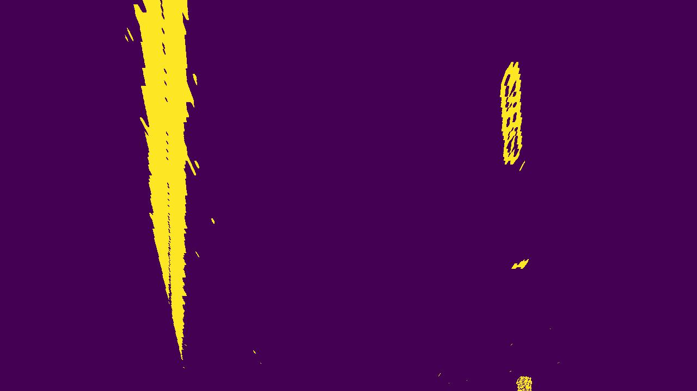

# Perspective transform

## 1. Description

The perspective transform operation is used to transform an image taken from one angle to an image taken from a
different angle. Here, I am interested to transform an image taken from the front of the car to a birds-eyes-view image.

## 2. Example images

#### Image without perspective transform

#### Image with perspective transform

## 3. Code

The [FrameTransformer](../src/domain/frame_transformer.py) class is responsible for the perspective transform through
its get_perspective_transform_parameters(), apply_perspective_transform(), and apply_inverse_perspective_transform()
methods. To obtain the transform matrices I am using 4 source points and 4 destination points (manually chosen) and then
I apply the openCV getPerspectiveTransform function. The source points define the area in the original image that I want
to transform. The destination points define the target view of the source points after the transformation. Finally, to
transform and un-transform the images I apply the openCV warping functions using the appropriate transform matrix.

#### The get_perspective_transform_parameters method

    def get_perspective_transform_parameters(self, frame: np.ndarray) -> None:
        source_points = np.float32(SOURCE_POINTS)
        frame_height, frame_width, _ = frame.shape
        x_min_pixel = int(frame_width * DESTINATION_X_MIN_PERCENTAGE)
        x_max_pixel = int(frame_width * DESTINATION_X_MAX_PERCENTAGE)
        destination_points = np.float32([[x_min_pixel, 0],
                                         [x_min_pixel, frame_height],
                                         [x_max_pixel, 0],
                                         [x_max_pixel, frame_height]])
        self.transform_matrix = cv2.getPerspectiveTransform(source_points, destination_points)
        self.transform_matrix_inverse = cv2.getPerspectiveTransform(destination_points, source_points)
        get_logger().info("Calculated the perspective transform matrices")

#### The apply_perspective_transform method

    def apply_perspective_transform(self, frame: np.ndarray) -> np.ndarray:
        frame_size = (frame.shape[1], frame.shape[0])
        frame_transformed = cv2.warpPerspective(frame, self.transform_matrix, frame_size)
        return frame_transformed

#### The apply_inverse_perspective_transform method

    def apply_inverse_perspective_transform(self, frame: np.ndarray) -> np.ndarray:
        frame_size = (frame.shape[1], frame.shape[0])
        frame_transformed = cv2.warpPerspective(frame, self.transform_matrix_inverse, frame_size)
        return frame_transformed