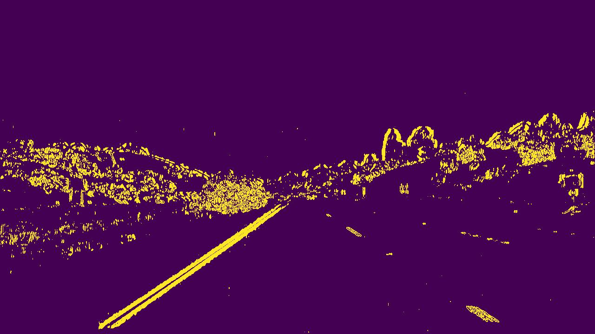
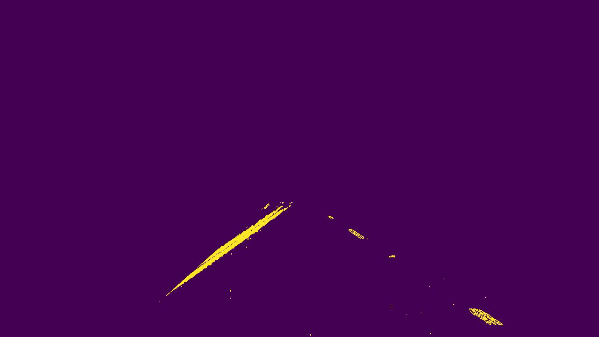

# Region of interest (ROI)

## 1. Description

The isolation of a region of interest from a frame helps the lanes' detector to focus on calculating coordinates only in
the area we are expecting to find road lanes.

## 2. Example images

#### Before ROI isolation

#### After ROI isolation

## 3. Code

The [FrameTransformer](../src/domain/frame_transformer.py) class is responsible for isolating a region of interest
through its isolate_region_of_interest() method. More specifically, we apply a mask on the image outside the ROI. The
polygon defining the ROI was manually defined.

    def isolate_region_of_interest(self, frame: np.ndarray) -> np.ndarray:
        mask = np.zeros_like(frame)
        vertices = self._get_vertices(frame)
        if len(frame.shape) > 2:
            channel_count = frame.shape[2]
            ignore_mask_color = (255,) * channel_count
        else:
            ignore_mask_color = 255
        cv2.fillPoly(mask, vertices, ignore_mask_color)
        masked_frame = cv2.bitwise_and(frame, mask)
        return masked_frame

    @staticmethod
    def _get_vertices(frame: np.ndarray) -> np.ndarray:
        frame_height, frame_width = frame.shape
        roi_x_bottom_min_pixel = int(frame_width * ROI_WIDTH_LIMIT_BOTTOM_MIN)
        roi_x_bottom_max_pixel = int(frame_width * ROI_WIDTH_LIMIT_BOTTOM_MAX)
        roi_x_top_min_pixel = int(frame_width * ROI_WIDTH_LIMIT_TOP_MIN)
        poi_x_top_max_pixel = int(frame_width * ROI_WIDTH_LIMIT_TOP_MAX)
        roi_y_top_pixel = int(frame_height * ROI_HEIGHT_LIMIT)
        return np.array([[(roi_x_bottom_min_pixel, frame_height),
                          (roi_x_top_min_pixel, roi_y_top_pixel),
                          (poi_x_top_max_pixel, roi_y_top_pixel),
                          (roi_x_bottom_max_pixel, frame_height)]], dtype=np.int32)