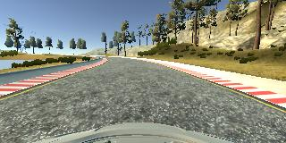
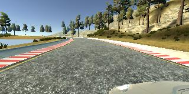
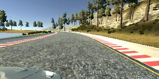
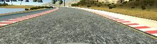
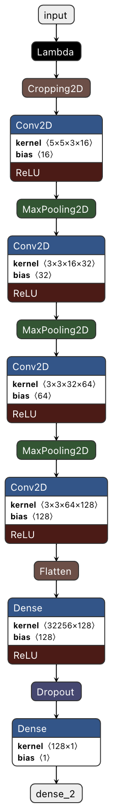
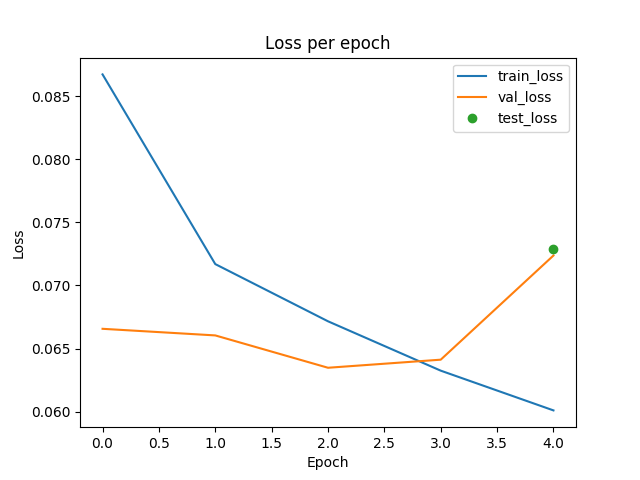

# Behavioral Cloning

[](http://www.udacity.com/drive)



Overview
---
The goal of this repo is to train a Deep Learning model replicate the driving behavior of 
a user of the Udacity Driving Simulation platform.

The repository contains the following files:
* scripts/model.py (script used to create and train the model)
* scripts/drive.py (script to autonomously drive the car using the model)
* scripts/video.py (script to create a video file from the frames collected from the autonomous driving)
* outputs/model.h5 (a trained Keras model)
* outputs/video.mp4 (a video recording of the vehicle driving autonomously around the first track)

Goals
---
The goals of this project are the following:
* Use the Udacity simulator to collect data of good driving behavior
* Design, train and validate a model that predicts a steering angle from image data
* Use the model to drive the vehicle autonomously around the first track in the simulator.

Requirements
---
    
To run this repository you will need the following packages

    scikit-learn==0.19.1
    Keras==2.0.9
    h5py==2.7.1
    opencv-contrib-python==4.1.0.25
    matplotlib==2.1.0
    numpy==1.16.3
    Pillow==5.2.0
    Flask==0.12.5
    eventlet==0.22.0
    moviepy==1.0.0
    argparse
    socketio

Entrypoints
---

### `model.py`

After collecting driving images and steering measurements from the simulator you can use this file to train the Keras model.
The steering measurements along with the paths to the driving images are collected in the driving_log.csv file.

```sh
python model.py --data_path path/to/driving_log/dir --validation_size X --test_size X --batch_size X --epochs X
```


### `drive.py`

To drive autonomously the car using the model.h5 file created by the model.py file you can run the following command.

```sh
python drive.py model.h5 dir_to_save_driving_frames
```

Then you can start the simulator and select the "autonomous mode".

### `video.py`

```sh
python video.py dir_to_save_driving_frames
```

This will create a video of the autonomous run(s). Optionally, you can specify the fps by using the --fps option (default is 60 fps).
To successfully create the video please make sure you have installed ffmpeg at your computer.

Dataset
---

I created my training dataset by collecting frames from multiple runs on the first track
of the simulator. To be able to obtain examples from any kind of situation that might arise
on the track I performed multiple runs on both sides of the track, recordings of recovering from 
going out of the track, and recordings of smoothly taking turns.

The car on the simulator is recording frames as if it has three cameras mounted on its face (at left, center, 
and right).

<table><tr>
<td>  </td>
<td>  </td>
<td>  </td>
</tr></table>

To obtain an estimation of the steering measurements from the left and right frames I applied a correction of 0.12 
and -0.12, respectively, to the steering measurements of the central frame.

Finally, all frames were cropped so that the face of the car and most of the background are cut from the 
frames to not confuse the model.

<table><tr>
<td>  </td>
<td>  </td>
</tr></table>

Model
---
My model consists of four convolutional layers (sizes can be seen below), the first three followed by a pooling layer 
(2X2 kernel), and two dense layers (sizes can be seen below) with a dropout layer (10% dropout) in between them.

All frames are normalized and cropped (50 top and 20 bottom pixels) before being sent to the convolutional layers. I used generators to 
load the training, validation and test sets to not overload the RAM. Finally, I used a "mean squared error" 
loss and an "adam" optimizer.




Results
---
I trained the model for 5 epochs, with a batch size of 8, a 70%/20%/10% split on the training/validation/test data
and kept only the weights from the epoch with the lowest validation score (third epoch).
The weights can be found at outputs/model.h5, and the final video at outputs/video.mp4.



