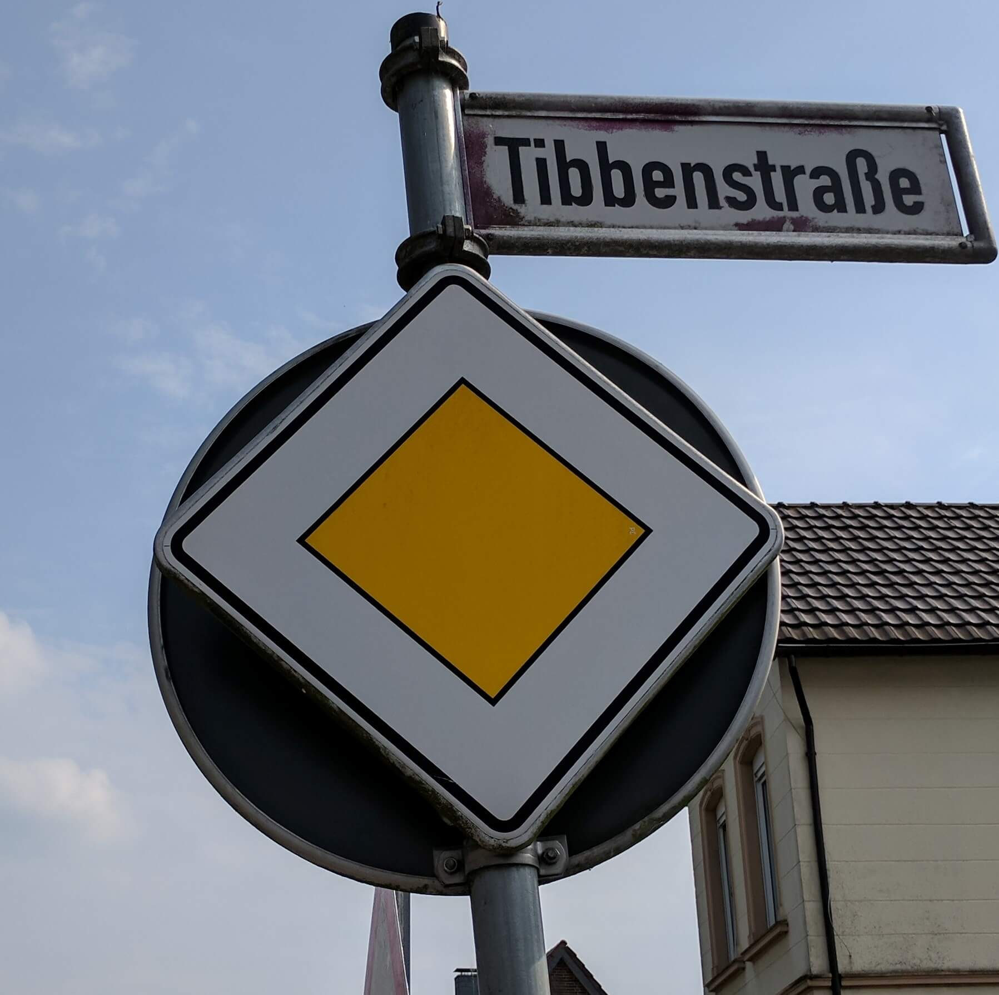
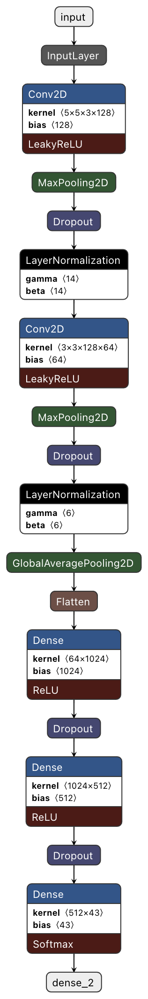

# Traffic Sign Recognition Classifier

Overview
---
This project contains a deep classifier, build using Keras, to recognize traffic signs.
I trained the classifier on the [German Traffic Signs Dataset](https://benchmark.ini.rub.de), achieving
94% accuracy on the test set.

### Requirements

- Python==3.6.13
- numpy==1.19.5
- tensorflow==2.5.0
- keract==4.5.0
- opencv-python==4.5.2.52
- imgaug==0.4.0
- tqdm==4.61.0
- matplotlib==3.3.4
- seaborn==0.11.1

To create the conda environment please execute:

    conda create -n traffic-classifier python=3.6 -y
    conda activate traffic-classifier
    pip install -r requirements.txt

### Dataset

I used the [German Traffic Signs Dataset](https://benchmark.ini.rub.de) for this project. The dataset is split into
train, validation and test sets and can be found as pickle files into the ./dataset directory.

    dataset/
    -- train.p
    -- valid.p
    -- test.p
There are 34799 training and 12630 test examples, each image is `32 X 32 X 3` and there are 43 classes in total.
You can download the dataset from [here](https://s3-us-west-1.amazonaws.com/udacity-selfdrivingcar/traffic-signs-data.zip).

I also selected 8 extra images (./dataset/new_*.jpg) from the internet and used them for extra testing of the model.
See below an example (Traffic_Sign_Classifier.ipynb for full examples):

##### Preprocessing

The preprocessing pipeline of the dataset was:

1. Gray-scale conversion
2. Image normalization

I converted all images to grayscale to provide the classifier overall information about the edges of the sign
irrespective of color. Normalizing their values allows passing values to the classifier that will end up not
exploding the gradients.

##### Augmentation

1. Random flipping
2. Linear contrast

I decided to augment the training set to get a more equalized distribution of classes and to add more examples of real
life conditions into it. I applied some random flipping to the images and added some contrast. The flipping
is not implemented according to the image's class but is applied randomly to all images. This is certainly not optimal in the
prediction of certain classes (like a stop sign or turn left sign), but overall it helped improve the performance of
the classifier.

The final size of the augmented training set is 74217, which is a bit more than double the original training set size.

### Model

As a classifier I used two convolutional layers followed by two dense layers. Each convolutional layer
is followed by a max pooling, a dropout and a layer-normalization layer. Each dense layer is followed by
a dropout layer.

To end up with this architecture I experimented with adding +- one convolutional and dense layers, but a choise of
two and two proved to be enough. It was very important to add the four dropout and two pooling layers to not let the
model overfit. Finally, the LeakyReLU activation and the layer-normalization proved to be crucial for allowing
the gradients to propagate smoother, and the classifier to learn efficiently.

The full architecture of the model used can be seen below:

##### Training

The model is trained for 100 epochs, with a batch size of 1280, using an Adam optimizer, and Sparse Categorical Crossentropy loss.
Moreover, it saves the weights every time the validation accuracy increases. The highest validation accuracy is 95%.

##### Testing

I test the performance on the test set and the 8 extra images using the weights with the best validation error.
The performance on the test set is 93%.

We can observe that even though the model has a great accuracy on the test set, it is not able to correctly classify
all the traffic signs collected from the internet. This may be due to the following:

1. The images have very different characteristics than those in the training set, thus making it hard
   for the model to infer correctly on the new images.
2. The image size has to be converted to 32X32X3 to match those in the
   [German Traffic Signs Dataset](https://benchmark.ini.rub.de). This means that the image loses
   a lot of information.
3. The training images are focused on the sign, which is not the case with the new ones.
4. The new images contain multiple signs and watermarks, thus making the task even harder for the classifier.

Finally, we can conclude that the model is very good to classify focused images that resemble those of the training set.
However, in order to classify a more general set of images it would require to be either trained on a more extensive
(or even more augmented) dataset or to be joined with an object detector to help focus on the area of interest. 